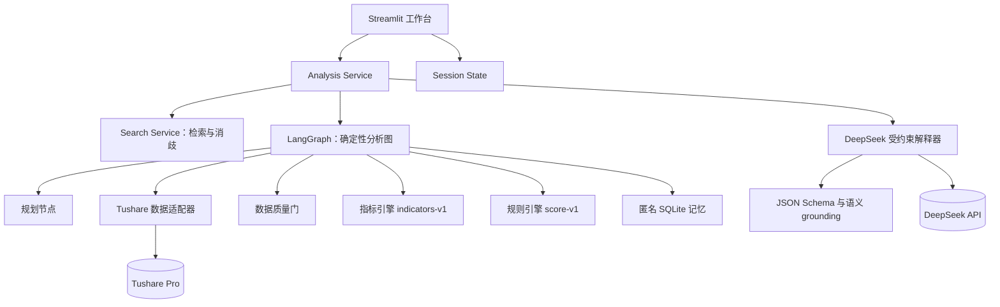
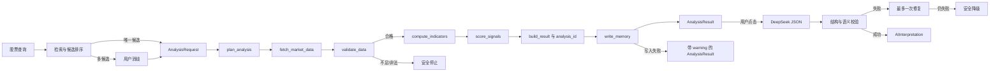
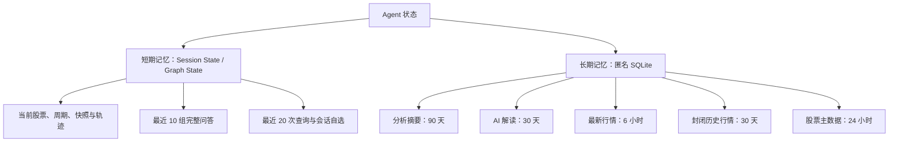

# A股智研台架构说明

本文描述 `indicators-v1`、`score-v1` 与 `prompt-v1` 对应的首版架构。系统的原则是：行情与指标由确定性程序计算，规则引擎给出主信号，大模型只解释已校验的结构化事实。

## 1. 系统边界

- 支持沪深、创业板、科创板与北交所上市 A 股，输入可为六位代码、Tushare 代码、全名或名称片段。
- 使用 Tushare `daily` 与 `adj_factor` 构造截止请求日的前复权日线；不称为实时行情，并始终展示“数据最后交易日”。
- 计算 MA、MACD、布林带、RSI、KDJ、ATR、OBV 与成交量动能，再由 `score-v1` 输出五档技术面信号。
- DeepSeek-V4-Flash 仅在用户点击后解释，不重新计算指标，不覆盖规则主信号。
- 不覆盖基本面、新闻、组合优化、分钟行情、自动交易、个性化仓位或收益预测。

## 2. 模块架构

UI 不直接调用外部 API。Search Service 在分析图外完成候选消歧，只有用户选定股票后才创建 `AnalysisRequest`。外部适配器均可注入 fake，因此自动测试和默认评测不联网。

## 3. 受控 Agent 数据流

每个图节点只返回状态增量。失败分支停止下游计算；模型失败不影响已经完成的量化分析；持久化失败保留 `analysis_id`，只增加系统 warning。

## 4. 框架与模型选型

| 方案 | 优点 | 局限 | 结论 |
|---|---|---|---|
| LangGraph 受控状态图 | 节点、条件边、状态和轨迹显式；易于 fake 与单测；错误可在边界停止 | 多一个框架依赖 | 采用 |
| 轻量 Python 编排 | 依赖少、直接 | 状态生命周期、分支和可观测性需自行维护 | 备选，不采用 |
| 全自主工具调用 Agent | 交互灵活 | 计算路径不稳定、成本高、难以复现，不适合金融数值主链 | 不采用 |

DeepSeek-V4-Flash 使用 OpenAI 兼容接口、JSON Object 模式与关闭 thinking 的固定参数。模型输入只有股票信息、日期、指标快照、规则评分、证据、风险与观察位；服务端在模型结果外附加规则信号、模型版本、缓存状态与固定免责声明。

## 5. SDD 输入、输出与核心逻辑

### 5.1 主要输入

| 输入 | 关键字段 | 约束 |
|---|---|---|
| `StockQuery` | `query`、`lookback_months`、`end_date` | 查询 1–30 字符；周期只允许 3/6/12/24/36 月；截止日不得在未来 |
| `AnalysisRequest` | `ts_code`、周期、请求截止日、指标配置 | `ts_code` 必须先经候选解析；首版指标参数冻结 |
| `AIRequest` | `analysis_id`、`force_refresh` | 只引用已完成的结构化分析；UI 默认不暴露强刷 |
| `ChatRequest` | `thread_id`、`analysis_id`、`question` | 问题 1–500 字符且必须存在当前分析 |

### 5.2 主要输出

`AnalysisResult` 包含状态、股票、请求/实际日期、数据质量、时序、最新快照、评分、节点轨迹、`analysis_id`、warnings 和安全错误。`AIInterpretation` 只在 Schema 与语义校验通过后构造；失败返回 `AgentError`，不返回半成品。

### 5.3 确定性契约

- 前复权：`qfq_price(t) = raw_price(t) × adj_factor(t) / adj_factor(anchor)`，`anchor` 为不晚于请求截止日的最后实际交易日，禁止使用未来因子。
- 指标公式版本为 `indicators-v1`；MACD 柱不乘 2，布林标准差 `ddof=0`，RSI/ATR 使用 Wilder RMA，KDJ 从 K=D=50 起步，OBV 首值为 0。
- 评分规则版本为 `score-v1`；方向容量为趋势 40、动量 30、量价/波动 27，总容量 97。缺失项不按 0 分处理，至少两个可用组且可用权重不少于 60 才输出总分。
- AI grounding：证据 key 必须来自服务端白名单，数值误差不得超过冻结容差；观察位必须来自七个服务端基准 key。
- `analysis_id` 绑定股票、解析截止日、周期、行情摘要、指标版本和评分版本；AI 缓存键再绑定实际模型与提示词版本。

## 6. 短期与长期记忆

| 记忆 | 创建与更新 | 失效/清理 | 隔离与隐私 |
|---|---|---|---|
| 当前分析上下文 | 开始分析时创建，节点完成时更新 | 切股、重置或浏览器会话结束 | 仅当前会话 |
| 对话历史 | 成功追问后成组追加 | 最多 10 组；切股整组清空 | 不写入 SQLite |
| 最近查询/自选 | 成功解析或用户收藏时更新 | 最近查询最多 20 条；会话结束清除 | 不作跨访客共享 |
| 分析摘要 | 评分完成后匿名写入 | 90 天 TTL，惰性清理 | 不保存身份、密钥或完整对话 |
| AI 解读 | 仅校验成功后写入 | 30 天 TTL；版本变化生成新键 | 失败响应不缓存 |
| 行情/主数据 | 成功取得并校验后写入 | 最新 6 小时、封闭历史 30 天、主数据 24 小时 | 仅公共结构化市场数据 |

`now == expires_at` 即过期。Streamlit Community Cloud 的本地 SQLite 不保证跨重启持久；它是性能缓存和匿名情景记忆，不是耐久用户数据库。

## 7. 安全、错误与可观测性

- 部署者通过 Streamlit Secrets 或环境变量配置 `TUSHARE_TOKEN` 与 `DEEPSEEK_API_KEY`；公开页面的访客无需输入、也不能看到 Key。
- 日志、`plan_trace`、错误与评测报告不得包含密钥、Authorization Header、完整提示词、堆栈或内部路径。
- `AgentError` 仅暴露 `CONFIG / AUTH / RATE_LIMIT / DATA / VALIDATION / MODEL / INTERNAL`、可操作中文提示、是否可重试与匿名 `trace_id`。
- 缺少 DeepSeek Key 时，确定性量化分析仍可使用；缺少 Tushare Token 时禁用数据分析并提示部署者配置。
- Tushare 股票主数据及本项目所用日线能力要求账号至少具备 2000 积分；权限不足不得用伪造数据替代。
- 规则信号永远是主信号；AI 若复述不一致，界面显式标错并保留规则结论。

## 8. 部署拓扑

代码发布到公开 GitHub，CI 在无 Secrets 环境运行单测、离线评测和安全扫描；Streamlit Community Cloud 从默认分支部署 `app.py`，真实密钥只进入 Cloud Secrets。生产访问显示最后交易日和缓存状态，不把日线称为实时数据。

固定风险声明：**仅供学习研究，不构成投资建议**。
