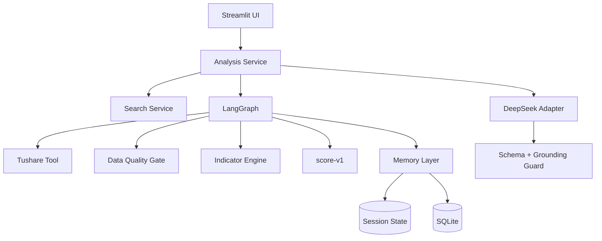
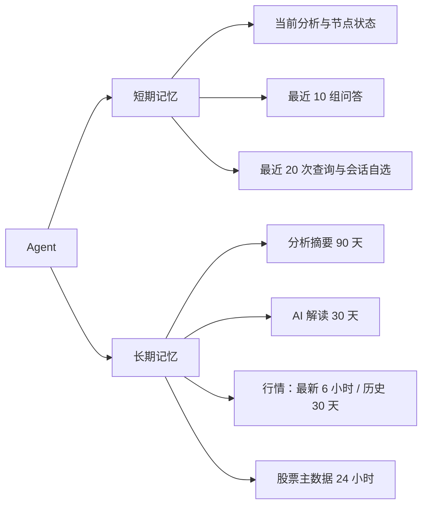

> 项目代号：A股智研台  
> 提交版本：`indicators-v1 / score-v1 / prompt-v1`  
> 固定风险声明：仅供学习研究，不构成投资建议

# 1 选题名称

**A股智研台：基于 Tushare、LangGraph 与 DeepSeek-V4-Flash 的可解释量化技术分析智能体**

# 2 选题背景

个人投资者可以轻易看到价格和单个技术指标，却常难以统一指标口径、处理相互冲突的信号并追溯结论依据。若让大模型直接读取原始行情并自行计算，容易产生数值错误、未来数据穿越、口径漂移和无法复现的结论。

本项目采用“确定性量化计算 + 受约束 AI 解释”：Tushare 提供 A 股主数据与前复权日线，Python 计算技术指标和规则信号，LangGraph 编排可审计的规划/工具/记忆流程，DeepSeek-V4-Flash 只解释服务端结构化事实。系统既展示 Agent 的状态与记忆，又保持金融数值主链确定、可测试、可降级。

# 3 需求说明文档

## 3.1 用户与目标

面向学习量化分析或 Agent 开发的学生、个人研究者和课程评审者。用户可用代码或中文名称寻找 A 股，选择回看周期，查看指标、规则评分、证据、风险、观察位，并按需请求 AI 解读和当前股票追问。

## 3.2 功能需求

1. 支持 `600519`、`600519.SH`、完整中文名和名称片段；多候选必须由用户消歧，模型不得猜测。
2. 支持沪深主板、创业板、科创板和北交所上市股票，周期为 3/6/12/24/36 月，默认 12 月。
3. 使用 Tushare `daily + adj_factor` 自行构造 point-in-time 前复权日线，额外取至少 120 个交易日预热；显示数据最后交易日，不称为实时数据。
4. 计算 MA、MACD、布林带、RSI、KDJ、ATR、OBV 和成交量动能；由 `score-v1` 输出偏多、中性偏多、中性、中性偏空、偏空五档信号。
5. 显示分组分、正负/冲突证据、数据完整度、信号一致度、风险等级和有来源的观察位。
6. AI 仅在点击后调用，输出严格 JSON，并对指标引用和观察位做 grounding；不一致时以规则信号为主。
7. 支持当前股票最多 10 组完整追问，切换股票后隔离线程。
8. 支持会话短期记忆与匿名 SQLite 长期记忆/缓存，并明确生命周期。
9. 缺配置、权限不足、数据非法、外部服务失败或持久化失败时安全降级；不得伪造行情或泄露密钥。

## 3.3 非功能与安全需求

- Python 3.11；确定性模块优先纯函数，外部服务可注入 fake；自动测试和默认评测不联网。
- Tushare 部署账号至少需要 2000 积分；真实权限以账号和接口规则为准。
- Key 由部署者写入本地或 Streamlit Cloud Secrets，访客无需输入 Key，页面不展示凭据输入框。
- API Key、Token、Authorization、完整提示词、完整模型原文、内部路径和堆栈不得进入日志、轨迹或公开错误。
- 同一输入得到可复现的指标与评分；页面刷新不得自动调用付费模型。
- 所有页面固定显示“仅供学习研究，不构成投资建议”。

## 3.4 范围外

不支持港美股、基金、指数、期货、分钟行情、基本面估值、新闻情绪、组合优化、自动交易、个性化仓位、收益预测或收益承诺；首版无账号、多租户身份或生产级耐久数据库。

# 4 技术设计文档（技术/模型选型）

完整说明见 [架构文档](../architecture.md)。

## 4.1 技术栈

- Python 3.11、Pandas、NumPy：前复权、指标与确定性评分；
- LangGraph：受控分析状态图；
- Tushare Pro：股票主数据、日线和复权因子；
- DeepSeek-V4-Flash（OpenAI 兼容 API）：按需结构化解释与追问；
- Pydantic：领域契约、AI JSON Schema 与有限数值约束；
- SQLite + Streamlit Session State：长期/短期记忆；
- Streamlit + Plotly：单页工作台和响应式图表；
- pytest：单元、契约、状态图、UI 与离线评测测试。

## 4.2 Agent 框架比较

| 方案 | 优点 | 主要风险 | 决策 |
|---|---|---|---|
| LangGraph | 显式状态、条件边、节点轨迹与可测试依赖注入；适合失败即停止的金融流程 | 增加框架依赖 | 采用 |
| 轻量 Python 编排 | 简单、依赖少 | 需自行实现状态、分支、生命周期和可观测性 | 替代方案 1，不采用 |
| 全自主工具调用 Agent | 灵活、扩展快 | 路径不稳定、成本高、数值与复现风险大 | 替代方案 2，不采用 |

项目要展示 Agent 的规划、工具与记忆，但不需要模型自由决定金融计算路径。LangGraph 让每个节点的输入、输出和终止条件显式，因此比两个替代框架更符合可审计和安全降级目标。

## 4.3 总体架构



股票搜索在图外完成候选消歧。图内顺序为 `plan_analysis → fetch_market_data → validate_data → compute_indicators → score_signals → build_result → write_memory`。异常通过条件边进入安全终态；AI 调用在成功分析后由用户按钮单独触发。

## 4.4 记忆与生命周期



短期记忆位于 Session State/Graph State，切股、重置或会话结束后失效；问答只保留最近 10 组并成组淘汰。长期记忆是匿名 SQLite 结构化摘要和缓存，不保存用户身份、完整聊天、Token 或 API Key。`now == expires_at` 即过期。Streamlit Cloud 本地 SQLite 可能在重启后清空，不能声称耐久持久化。

## 4.5 SDD 输入、输出和核心逻辑

输入：`StockQuery(query, lookback_months, end_date)` 先解析为候选；用户确认后生成 `AnalysisRequest(ts_code, lookback_months, requested_end_date, indicator_config)`。成功分析后，`AIRequest(analysis_id)` 才能按需解释；`ChatRequest(thread_id, analysis_id, question)` 必须绑定当前分析。

输出：`AnalysisResult` 返回状态、股票、期间、数据质量、时序、快照、评分、节点轨迹、`analysis_id`、warnings 和安全错误；`AIInterpretation` 返回已 grounding 的证据/风险/观察位，并由服务端附加规则信号、consistency、固定免责声明、模型、提示词版本和缓存状态。

核心逻辑：

- `qfq_price(t)=raw_price(t)×adj_factor(t)/adj_factor(anchor)`；anchor 不晚于请求截止日，禁止未来因子。
- `indicators-v1` 冻结 EMA、MACD、布林 `ddof=0`、Wilder RSI/ATR、KDJ seed=50、OBV seed=0 等公式。
- `score-v1` 的趋势/动量/量价容量为 40/30/27，总容量 97；缺失规则不当作 0 分，覆盖不足返回数据不足。
- AI 数值必须与服务端快照和观察位在冻结容差内一致；非法结果最多修复一次，失败不缓存。
- 缓存键绑定 `analysis_id | actual_model | prompt_version`，页面刷新和重复点击可复用成功结果。

## 4.6 安全边界

规则引擎是技术面主信号的唯一来源，模型不能覆盖或重新计算。Tushare/DeepSeek 错误映射为不含敏感内容的 `AgentError`。量化能力和 AI 能力分离，因此模型不可用时仍可阅读确定性结果；持久化失败只增加 warning。

# 5 评测报告

完整方法和限制见 [离线评测报告](../evaluation-report.md)。可复跑入口为：

```bash
.venv/bin/python scripts/evaluate.py
.venv/bin/python -m pytest tests/test_evaluation.py -q
```

冻结评测规模为 100 个搜索标注、500 行/5 种静态行情、10 个数据质量案例、50 个 AI grounding 案例、10 次缓存复用和 25 个完整异常矩阵案例。强制门槛为搜索 Top-5 ≥95%，指标参考一致、数据质量检测、AI grounding、cache skip 和异常安全降级均为 100%。当次机器结果以 ignored `artifacts/evaluation-report.json` 为准。

指标参考版本为 `evaluation-reference-v1`，与 `indicators-v1` 按 `rtol=1e-6`、`atol=1e-8` 比较。报告披露 Python/平台/依赖和分套件耗时，但定时不作为 CI 门槛。历史未来 5/20 日收益只允许描述性评测，不设收益 CI 门槛，不作为未来收益保证。

# 6 用户使用手册

完整步骤见 [用户使用手册](../user-guide.md)。

访客打开页面后输入股票代码或名称，确认候选、选择周期、点击分析并先检查数据最后交易日。指标和规则评分完成后，用户可显式点击生成 AI 解读，再就当前股票进行最多 10 组追问。公开访客无需输入 Key；部署者负责 Tushare 2000 积分、Secrets、服务额度和部署维护。

量化信号、风险级别和观察位均用于学习研究。规则信号不是概率；观察位不是止损或目标价；AI 失败或不一致时，以规则信号和确定性证据为准。

# 7 作品体验链接

- GitHub 公开仓库：`https://github.com/<owner>/<repository>`（**占位符：Task 11 发布后替换为已验证 URL**）
- Streamlit 在线体验：`https://<app-name>.streamlit.app`（**占位符：Task 11 部署后替换为已验证 URL**）

发布后需在未登录浏览器验证页面可访问、访客无凭据输入框、候选消歧、数据日期、图表、规则证据、显式 AI、缓存、追问、窄屏布局和固定风险声明。

**仅供学习研究，不构成投资建议**。
