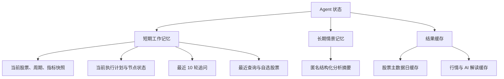
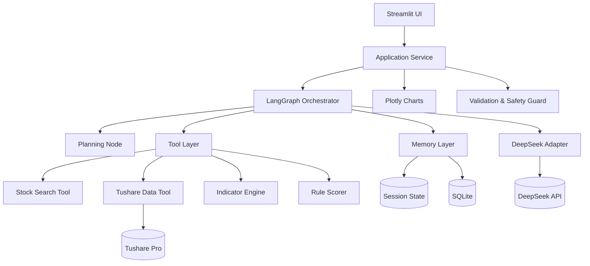

# A股技术分析智能体：总体设计与 SDD 核心规格

> 文档状态：已实现并通过本地验收
>
> 日期：2026-08-12
>
> 项目代号：A股智研台
>
> 面向对象：课程评审者、开发者、部署者与最终用户

## 1. 选题名称

**A股智研台：基于 Tushare、LangGraph 与 DeepSeek-V4-Flash 的可解释量化技术分析智能体**

## 2. 选题背景

个人投资者通常能看到行情和零散技术指标，却难以解决三个问题：同一组指标如何统一计算、彼此冲突时如何综合判断、结论依据如何追溯。通用大模型若直接读取原始价格并自行计算指标，容易出现数值错误、口径不一致与不可复现结论。

本项目采用“确定性量化计算 + 受约束的智能解释”路线：Tushare 提供 A 股基础资料与前复权日线，Python 工具计算技术指标和规则评分，LangGraph 编排可审计的分析流程，DeepSeek-V4-Flash 仅基于结构化事实生成中文解读。系统提供短期对话记忆与轻量长期记忆，同时明确其不是自动交易系统，也不输出收益承诺。

## 3. 产品定位与范围

### 3.1 一句话定位

一个支持 A 股代码或中文名称模糊检索、自动计算多类技术指标、生成可解释技术面信号并支持上下文追问的教学型 AI Agent。

### 3.2 目标用户

- 学习量化分析、技术分析或 Agent 开发的学生；
- 希望快速理解 A 股技术状态的个人研究者；
- 需要演示 SDD、记忆、工具调用和规划流程的课程评审者。

### 3.3 首版范围

包含：

- 沪深 A 股、创业板、科创板、北交所上市股票；
- 股票代码、Tushare 代码和中文名称的精确或模糊查询；
- 候选股票消歧；
- 前复权日线，支持 3、6、12、24、36 个月，默认 12 个月；
- MA、MACD、布林带、RSI、KDJ、ATR、OBV 和成交量动能；
- 可解释的规则评分与五档技术面信号；
- DeepSeek-V4-Flash 按需解读与最多 10 轮上下文追问；
- 会话短期记忆、匿名 SQLite 长期分析情景记忆与 AI 结果缓存；
- Streamlit Web 界面、GitHub 公共仓库和 Streamlit Community Cloud 部署。

不包含：

- 港股、美股、基金、ETF、指数、期货或分钟级实时行情；
- 基本面估值、新闻情绪、组合优化和自动交易；
- 个性化仓位、收益预测、收益承诺或确定性买卖指令；
- 用户注册、多租户身份与生产级跨实例数据库。

## 4. 核心功能需求

### 4.1 股票检索与消歧

1. 用户可输入 `600519`、`600519.SH`、`贵州茅台` 或名称片段。
2. 系统先做标准化，再在上市股票主数据中按以下优先级匹配：
   1. 完整 `ts_code`；
   2. 六位证券代码；
   3. 完整股票名称；
   4. 名称包含匹配；
   5. 名称近似匹配。
3. 若存在多个候选，界面展示代码、名称、市场、行业等信息供用户选择；不得由模型猜测目标股票。
4. 股票主数据采用 24 小时 TTL 缓存；缓存失效或读取失败时重新从 Tushare 拉取。

### 4.2 行情提取与质量校验

1. 使用 Tushare Pro 的 `daily` 与 `adj_factor` 获取未复权交易日线和复权因子，自行构造前复权数据。对任一价格列，`qfq_price(t)=raw_price(t)×adj_factor(t)/adj_factor(anchor)`；`anchor` 是不晚于请求截止日的最后实际交易日，历史分析禁止使用该日之后的因子。`open/high/low/close/pre_close` 复权后保留未舍入浮点值，`vol/amount` 不复权，并由复权后的价格重算 `change/pct_chg`。行情日缺少因子时直接返回数据错误，不做填充。
2. 为避免长周期指标在展示区间起点失真，实际抓取起始日早于用户所选起始日，至少预留 120 个交易日作为预热窗口；计算完成后再裁剪展示区间。
3. 数据按交易日期升序排列。完全相同的重复交易日保留一条；同一交易日数值冲突时返回数据错误，不得任意保留其中一条。
4. 必须校验：必要字段、日期严格递增、OHLC 与 `pre_close` 严格大于 0、成交量/成交额非负、OHLC 关系（`high >= max(open, close, low)` 且 `low <= min(open, close, high)`）、展示起始日之前的有效预热样本数和最后交易日。预热少于 60 条时返回“数据不足”，60–119 条时允许分析但添加长周期指标可能不稳定的质量警告。
5. 页面显式显示“数据最后交易日”，不得把日线数据称为实时数据。
6. 网络失败、权限不足、积分不足、停牌或历史不足时，返回可操作的中文错误信息；不得用伪造数据静默替代。

### 4.3 技术指标

所有指标由 Python/Pandas 确定性计算，DeepSeek 不参与数值计算。

| 指标 | 默认参数 | 主要用途 |
|---|---:|---|
| 简单移动平均线 | MA5、MA10、MA20、MA60 | 多周期趋势与排列 |
| MACD | EMA12、EMA26、Signal9 | 趋势与动量交叉 |
| 布林带 | 20 日、2 倍标准差 | 相对位置与波动扩张 |
| RSI | 14 日，Wilder 平滑 | 超买超卖与动量 |
| KDJ | 9、3、3 | 短周期动量与交叉 |
| ATR | 14 日，Wilder 平滑 | 波动风险与观察区间 |
| OBV | 标准累积法 | 量价方向确认 |
| 成交量动能 | VOL/MA20 | 放量或缩量确认 |

指标模块的公共输出为原始行情字段加指标字段的 DataFrame，并额外返回最新指标快照。计算过程中不得使用未来数据；滚动窗口和指数平滑只允许依赖当前及过去观测。首版公式冻结如下：

- SMA 与成交量均线使用 `rolling(window, min_periods=window).mean()`；
- EMA 使用 Pandas `ewm(span=n, adjust=False, min_periods=n).mean()`；MACD 为 `EMA12 - EMA26`，Signal 为其 9 日 EMA，Histogram 为 `MACD - Signal`，不乘 2；
- 布林中轨为 SMA20，上下轨为中轨加减 `2 × rolling_std(ddof=0)`；中轨为 0 时带宽记为缺失；
- RSI14 使用 Wilder RMA：上涨/下跌序列以 `ewm(alpha=1/14, adjust=False, min_periods=14)` 平滑；平均跌幅为 0 且平均涨幅大于 0 时 RSI=100，两者均为 0 时 RSI=50；
- KDJ 使用 9 日最高/最低，`RSV=(close-low9)/(high9-low9)×100`；分母为 0 时 RSV=50；在第一个有效 RSV 到来前令 `K_prev=D_prev=50`，第一个有效日也执行 `K=2/3×K_prev+1/3×RSV`、`D=2/3×D_prev+1/3×K`，随后逐日递推；J=`3K-2D`，展示时不裁剪 J；
- True Range 首日使用 `high-low`，其后为 `max(high-low, |high-prev_close|, |low-prev_close|)`；ATR14 使用与 RSI 相同的 Wilder RMA；
- OBV 首个有效值为 0；上涨加当日成交量、下跌减当日成交量、平盘不变；
- 任一中间结果出现正负无穷时转换为缺失；评分前只读取最新一行及明确声明的历史窗口，缺失项不得当作 0 分处理。

### 4.4 可解释评分

评分器将信号拆为三组，所有单项得分和解释均可展示。规则版本固定为 `score-v1`：

| 分组 | 规则 | 满足偏多条件 | 满足偏空条件 | 分值 |
|---|---|---|---|---:|
| 趋势 | 价格/MA20 | `close > MA20` | `close < MA20` | `+8 / -8` |
| 趋势 | 价格/MA60 | `close > MA60` | `close < MA60` | `+7 / -7` |
| 趋势 | 均线排列 | `MA5 > MA10 > MA20 > MA60` | 反向严格排列 | `+12 / -12` |
| 趋势 | MACD 线 | `MACD > Signal` 且柱值 > 0 | `MACD < Signal` 且柱值 < 0 | `+8 / -8` |
| 趋势 | MA20 斜率 | `MA20 / MA20.shift(5) - 1 > 0.5%` | `< -0.5%` | `+5 / -5` |
| 动量 | RSI14 | `[55, 70]` | `[30, 45]` | `+10 / -10` |
| 动量 | RSI 极值 | 无 | `RSI > 75` 或 `RSI < 25` 均记风险，不给方向分 | `0` |
| 动量 | KDJ 交叉 | 最近 3 个有效交易日内 K 上穿 D，且交叉日 K<80 | 最近 3 个有效交易日内 K 下穿 D，且交叉日 K>20 | `+8 / -8` |
| 动量 | MACD 柱动能 | 当前柱值 > 前一日且 >0 | 当前柱值 < 前一日且 <0 | `+7 / -7` |
| 动量 | 20 日动量 | `close/close.shift(20)-1 > 3%` | `< -3%` | `+5 / -5` |
| 量价/波动 | OBV 趋势 | `(OBV-OBV.shift(5))/5 > 0` 且 5 日价格收益 >0 | 二者均 <0 | `+8 / -8` |
| 量价/波动 | 成交量确认 | `close > prev_close` 且 `volume/vol_ma20 >= 1.2` | `close < prev_close` 且比率 >=1.2 | `+7 / -7` |
| 量价/波动 | 布林位置 | close 在中轨上方且不高于上轨 | close 在中轨下方且不低于下轨 | `+7 / -7` |
| 量价/波动 | 布林突破 | close > 上轨 | close < 下轨 | `+5 / -5`，并标突破风险 |
| 量价/波动 | ATR 风险 | `ATR14/close > 4%` | 不给方向分，加入波动风险 | `0` |
| 量价/波动 | 量价背离 | 价格 10 日方向与 OBV 10 日方向相反 | 无方向分，加入冲突证据 | `0` |

规则谓词进一步冻结如下：KDJ 交叉令 `diff=K-D`，上穿为交叉日 `diff>0` 且前一有效日 `diff<=0`，下穿反之；“最近 3 日”的阈值读取交叉日 K。若窗口内同时存在合格上穿和下穿，只采用时间最近的一次，单条规则最多计一次 `±8`。5/10/20 日价格收益分别为 `close/close.shift(n)-1`；OBV 5 日斜率为 `(OBV-OBV.shift(5))/5`；量价背离比较 10 日价格收益与 `OBV-OBV.shift(10)` 的符号。任一方向量等于 0 时视为中性，不构成该方向命中或背离；当日上涨/下跌以 `close` 相对 `prev_close` 严格大于/小于定义，平盘为中性。

某条方向规则的全部输入非缺失时称为“可评估”，无论它最终命中偏多、偏空或保持中性；任一输入缺失时才不可评估。全部方向规则的理论容量为趋势 40、动量 30、量价/波动 27，总计 97；风险专用规则不计方向容量。各组“可评估容量”是可评估方向规则的理论绝对分之和，分组原始分仅累加实际命中的带符号分。分组分=`原始分/可评估容量×分组权重`，并分别限制在趋势 `[-40,40]`、动量 `[-30,30]`、量价/波动 `[-30,30]`。可评估容量至少达到各组方向容量的 50%（趋势 ≥20、动量 ≥15、量价/波动 ≥14，非整数阈值向上取整）时该组才可用。三组中至少两组可用且总可用权重不少于 60 才输出总分；总分为可用组分之和再乘 `100/可用权重`，并限制在 `[-100,100]`。因此“全部规则可评估但均中性”得到 0 分，而不是数据不足。

总分限制在 `[-100, 100]`，映射如下：

| 分数区间 | 技术面信号 |
|---:|---|
| `[40, 100]` | 偏多 |
| `[15, 40)` | 中性偏多 |
| `(-15, 15)` | 中性 |
| `(-40, -15]` | 中性偏空 |
| `[-100, -40]` | 偏空 |

为消除边界歧义，实现必须按以下顺序判断：`score >= 40` 为偏多；否则 `score >= 15` 为中性偏多；否则 `score > -15` 为中性；否则 `score > -40` 为中性偏空；其余为偏空。因此 `15` 属于中性偏多，`-15` 属于中性偏空，`40` 属于偏多，`-40` 属于偏空。若有效指标不足，评分器标记为“数据不足”，不强行输出五档信号。

评分器同时计算：

- 正向证据、负向证据与冲突证据；
- 基于最近 20 个有效交易日高低点、MA20、布林带和 `close ± ATR14` 推导的观察位；所有价位标注来源，不称为止损或目标价；
- 数据完整度=`可评估方向规则理论绝对分/全部方向规则理论绝对分`，与观点方向及是否命中无关；
- 信号一致度=`|偏多生效分绝对值-偏空生效分绝对值|/(偏多生效分绝对值+偏空生效分绝对值)`，分母为 0 时记 0；
- 风险等级只由风险标记数量与强度决定：`4% < ATR/close <= 6%` 计 1 分，`ATR/close > 6%` 计 2 分；布林带外突破、RSI 极值各计 2 分；量价背离、`data_quality` 中的数据警告各计 1 分。持久化失败等系统 warning 不参与市场风险评分。0–1 为低、2–3 为中、≥4 为高。它不是收益概率或“置信概率”。

### 4.5 AI 解读

1. AI 解读必须由用户点击按钮按需触发，页面刷新不得自动扣费。
2. 使用 OpenAI 兼容客户端调用：
   - Base URL：`https://api.deepseek.com`
   - 模型：`deepseek-v4-flash`
   - 使用 `response_format={"type":"json_object"}` 与 `extra_body={"thinking":{"type":"disabled"}}`，固定非思考 JSON 模式以降低延迟和解析风险。
3. 输入仅包含股票基本信息、日期范围、最新价格、指标快照、规则评分、证据与风险约束，不发送 API Key、SQLite 内容或不相关历史。
4. 模型必须输出可校验 JSON，字段包括：
   - `model_signal`：模型复述的五档信号之一；
   - `summary`：简短结论；
   - `evidence`：证据列表；
   - `risks`：风险列表；
   - `watch_levels`：观察位及其依据；
5. 服务端在模型结果外附加不可由模型修改的 `rule_signal`、`consistency_status`（`consistent / mismatch`）和固定免责声明。模型不得覆盖、重新计算或伪造指标；若 `model_signal != rule_signal`，页面仅把 `rule_signal` 作为主信号并显示“不一致，AI 内容仅供参考”。
6. JSON 解析失败时最多进行一次修复请求；仍失败则显示安全降级信息，不缓存失败响应。
7. `analysis_id` 包含股票、解析后的最后交易日、周期、行情摘要哈希、指标版本和评分器版本；AI 缓存键为 `SHA256(analysis_id | actual_model | prompt_version)`。实际模型或提示词变化后不得复用旧响应；命中同一键后不再次调用 API。

AI 原始输出的最小 JSON Schema 为：

```json
{
  "type": "object",
  "additionalProperties": false,
  "required": ["model_signal", "summary", "evidence", "risks", "watch_levels"],
  "properties": {
    "model_signal": {"type": "string", "enum": ["偏多", "中性偏多", "中性", "中性偏空", "偏空"]},
    "summary": {"type": "string", "minLength": 1, "maxLength": 280},
    "evidence": {
      "type": "array", "minItems": 2, "maxItems": 6,
      "items": {
        "type": "object", "additionalProperties": false,
        "required": ["source_key", "observed_value", "interpretation"],
        "properties": {
          "source_key": {"type": "string"}, "observed_value": {"type": "number"},
          "interpretation": {"type": "string", "minLength": 1, "maxLength": 120}
        }
      }
    },
    "risks": {
      "type": "array", "minItems": 1, "maxItems": 6,
      "items": {
        "type": "object", "additionalProperties": false,
        "required": ["risk_type", "description"],
        "properties": {
          "risk_type": {"type": "string", "enum": ["volatility", "overbought", "oversold", "signal_conflict", "data_quality", "other"]},
          "evidence_key": {"type": ["string", "null"]},
          "description": {"type": "string", "minLength": 1, "maxLength": 120}
        }
      }
    },
    "watch_levels": {
      "type": "array", "minItems": 1, "maxItems": 6,
      "items": {
        "type": "object", "additionalProperties": false,
        "required": ["label", "price", "basis_key", "rationale"],
        "properties": {
          "label": {"type": "string", "enum": ["支撑观察", "压力观察", "波动参考"]},
          "price": {"type": "number", "exclusiveMinimum": 0},
          "basis_key": {"type": "string", "enum": ["recent_20d_low", "recent_20d_high", "ma20", "boll_upper", "boll_lower", "close_minus_atr", "close_plus_atr"]},
          "rationale": {"type": "string", "minLength": 1, "maxLength": 120}
        }
      }
    }
  }
}
```

除 JSON Schema 外还执行语义校验：`source_key` 必须来自服务端白名单并存在于快照，`observed_value` 与快照值误差不超过 `max(1e-6×|value|, 1e-6)`；`basis_key` 必须存在于服务端观察位映射，模型价格与服务端价格误差不超过 `max(0.01, 1e-6×|price|)`；`evidence_key` 非空时也必须来自白名单。任一失败均视为无效响应，进入最多一次修复流程。

### 4.6 上下文追问

1. 追问只在当前股票已成功分析后开放。
2. 允许用户询问指标含义、信号冲突、观察位依据和不同周期的解释。
3. 短期对话最多保留最近 10 组完整问答（至多 20 条用户/助手消息）；超限时删除最早完整问答。
4. 切换股票或重置分析时启动新的会话线程，防止股票上下文串线。
5. 追问不能触发自动交易或绕过免责声明；涉及个性化投资决策时应重申边界。

## 5. SDD 核心功能规范

### 5.1 输入定义

#### `StockQuery`

| 字段 | 类型 | 约束 |
|---|---|---|
| `query` | string | 去除首尾空白后 1–30 字符 |
| `lookback_months` | integer | `3, 6, 12, 24, 36` 之一 |
| `end_date` | date/null | 默认当前日期；仅允许不晚于当前日期，后端解析为不晚于该日期的最近可用交易日 |

#### `AnalysisRequest`

| 字段 | 类型 | 约束 |
|---|---|---|
| `ts_code` | string | 已从候选列表解析出的合法 A 股 Tushare 代码 |
| `lookback_months` | integer | 同上 |
| `requested_end_date` | date/null | 来自 StockQuery；null 表示当前日期 |
| `indicator_config` | object | 首版使用受支持的默认参数集合 |

#### `AIRequest`

| 字段 | 类型 | 约束 |
|---|---|---|
| `analysis_id` | string | 指向成功完成且仍在当前会话或匿名缓存中的结构化分析 |
| `force_refresh` | boolean | 默认 false；首版 UI 不暴露，测试和维护时可用 |

#### `ChatRequest`

| 字段 | 类型 | 约束 |
|---|---|---|
| `thread_id` | UUID string | 当前股票分析线程 |
| `question` | string | 1–500 个字符 |
| `analysis_id` | string | 指向成功完成的结构化分析 |

#### `StockSearchResult`

| 字段 | 类型 | 说明 |
|---|---|---|
| `status` | enum | `resolved / ambiguous / not_found / error` |
| `candidates` | list | 按匹配等级与相似度排序，最多 10 条 |
| `error` | AgentError/null | 仅在 error 状态存在 |

#### `ChatResponse`

| 字段 | 类型 | 说明 |
|---|---|---|
| `answer` | string/null | 成功时为有边界约束的中文回答；失败时为 null |
| `thread_id` | string | 当前分析线程 |
| `turn_count` | integer | 已成功保存的完整问答组数，范围 0–10 |
| `model` | string/null | 成功时为实际模型名；首次调用失败时可为 null |
| `error` | AgentError/null | 失败时存在 |

### 5.2 输出定义

#### `AnalysisResult`

| 字段 | 类型 | 说明 |
|---|---|---|
| `status` | enum | `success / insufficient_data / error` |
| `stock` | object | 代码、名称、市场、行业 |
| `period` | object/null | 成功或数据不足时存在；请求截止日、解析截止日、实际区间、最后交易日、复权方式 |
| `data_quality` | object/null | 行情取得后存在；行数、缺失情况、警告 |
| `series` | DataFrame/null | 成功时存在；行情与指标时序，仅在应用进程内使用 |
| `snapshot` | object/null | 成功时存在；最新指标的 JSON 可序列化快照 |
| `score` | object/null | 成功时存在；总分、分组分、五档信号、证据、风险与观察位 |
| `plan_trace` | list | 已执行节点及状态，不包含密钥或敏感提示词 |
| `analysis_id` | string/null | 在评分成功后、持久化前基于输入、数据日期和版本生成；外部存储失败不影响它 |
| `warnings` | list | 包括数据或持久化降级信息 |
| `error` | AgentError/null | `error` 状态时存在；其他状态为 null |

#### `AIInterpretation`

返回与 4.5 节 JSON Schema 一致的已校验对象，并由服务端附加 `rule_signal`、`consistency_status`、固定 `disclaimer`、`model`、`prompt_version`、`cache_hit` 和生成时间。失败时不构造部分对象，而是返回 `AgentError`。

#### `AgentError`

| 字段 | 类型 | 说明 |
|---|---|---|
| `code` | enum | `CONFIG / AUTH / RATE_LIMIT / DATA / VALIDATION / MODEL / INTERNAL` |
| `user_message` | string | 不含密钥、堆栈和内部路径的中文提示 |
| `retryable` | boolean | 是否适合用户稍后重试 |
| `trace_id` | string | 用于本地排查的匿名标识 |

### 5.3 核心状态机

```mermaid
flowchart LR
    U[用户输入] --> R[Search Service\n股票检索与候选排序]
    R -->|多个候选| C[UI 等待用户选择]
    R -->|唯一候选| AR[AnalysisRequest]
    C --> AR
    R -->|空结果/错误| SE[安全搜索提示]
    subgraph G[LangGraph 分析图]
      AR --> P[plan_analysis]
      P --> D[fetch_market_data]
      D -->|成功| Q[validate_data]
      D -->|外部错误| E[AgentError]
      Q -->|合格| I[compute_indicators]
      Q -->|样本不足| N[insufficient_data]
      Q -->|数据非法| E
      I -->|成功| S[score_signals]
      I -->|数值错误| E
      S -->|可用| X[build_result\n生成 analysis_id]
      S -->|覆盖不足| N
      X --> M[write_memory]
      M -->|成功| V[AnalysisResult]
      M -->|失败，加 warning| V
    end
    V --> UI[Streamlit 展示]
    N --> UI
    E --> UI
    UI -->|按需点击| A[DeepSeek 解读]
    A -->|成功| J[Schema + 语义校验]
    A -->|模型错误| F[AI 安全降级]
    J -->|有效| UI
    J -->|无效| RR[最多一次修复]
    RR -->|有效| UI
    RR -->|仍无效| F
    UI -->|追问| H[最近 10 组问答]
    H --> UI
```



### 5.4 节点契约

| 节点 | 必要输入 | 成功输出 | 失败策略 |
|---|---|---|---|
| `resolve_stock`（图外 Search Service） | 查询文本、股票主数据 | 有序候选列表 | 空结果返回建议，不调用分析图或模型 |
| `plan_analysis` | 已选股票、周期 | 显式节点计划、预热日期 | 参数非法直接校验失败 |
| `fetch_market_data` | 代码、日期、复权方式 | 规范化 OHLCV | Tushare 错误映射为安全错误 |
| `validate_data` | OHLCV | 质量报告 | 不合格停止下游 |
| `compute_indicators` | 合格 OHLCV | 指标时序、快照 | 数值异常停止评分 |
| `score_signals` | 指标时序、快照 | 分数、证据、风险、观察位 | 有效指标不足返回数据不足 |
| `build_result` | 评分结果、版本与日期 | `analysis_id`、AnalysisResult | 仅序列化失败时停止 |
| `write_memory` | `analysis_id`、结构化分析摘要 | 持久化确认 | 写入失败不阻断展示，添加 persistence warning |
| `interpret_with_ai` | 结构化摘要 | 原始 JSON 文本 | 未配置或失败时量化功能仍可用 |
| `validate_ai_json` | 模型响应、规则信号 | 已校验解读 | 一次修复后安全降级 |
| `answer_followup` | 当前摘要、最近 10 轮、问题 | 中文回答 | 无当前分析时拒绝执行 |

## 6. Agent 框架选型

### 6.1 候选方案

| 方案 | 优点 | 缺点 | 结论 |
|---|---|---|---|
| LangGraph 状态图 | 状态、条件分支、检查点和节点轨迹清晰；易于单测；可显式表现规划/工具/记忆模块 | 增加少量框架依赖 | **采用** |
| 轻量 Python 编排 | 简单、依赖少、开发快 | Agent 规划和状态生命周期需自行实现，作业展示力较弱 | 不采用 |
| 全自主工具调用 Agent | 交互灵活、扩展性强 | 计算路径不稳定、成本高、难以复现，金融场景风险更大 | 不采用 |

### 6.2 选择理由

本项目的核心不是让模型自由决定如何计算，而是在受控工具链上做解释与追问。LangGraph 的显式状态图可以把股票检索、数据拉取、质量校验、指标计算、规则评分、记忆写入和模型解释分成可独立测试的节点；条件边保证异常时不会继续产生误导结论；图状态与课程要求的短期记忆天然对应。首版在单次 Streamlit rerun 内同步调用已编译状态图，不启用跨用户 SQLite Checkpointer；会话线程由 `st.session_state` 隔离，候选消歧在 UI 层完成后才调用分析图，因此无需图内 interrupt/resume。SQLite 适合课程项目的匿名结果复用，但文档明确其在 Streamlit Cloud 重启后的持久性限制。

## 7. 智能体记忆设计

### 7.1 记忆类型



### 7.2 生命周期

| 记忆 | 载体 | 创建 | 更新 | 过期/清理 |
|---|---|---|---|---|
| 当前分析上下文 | `st.session_state` + LangGraph state | 用户选择股票并开始分析 | 每个节点完成后 | 切换股票、用户重置或浏览器会话结束 |
| 对话历史 | `st.session_state` | 第一次追问 | 每轮问答后 | 仅保留最近 10 轮；切换股票即清空 |
| 最近查询 | `st.session_state` | 成功解析股票后 | 同股票更新访问时间 | 保留本会话最近 20 条；会话结束即清除 |
| 自选股票 | `st.session_state` | 用户主动收藏 | 主动取消收藏 | 会话结束即清除；首版不声称跨访问持久化 |
| 分析摘要 | SQLite | 评分完成后 | 同一缓存键覆盖 | 90 天 TTL，启动时惰性清理 |
| AI 解读缓存 | SQLite | 响应校验成功后 | 版本或数据日期变化产生新键 | 30 天 TTL；失败响应不缓存 |
| 行情缓存 | SQLite | 成功取得并校验行情后 | 缓存键变化产生新记录 | “最新”请求（截止日为空或等于请求当日）始终 6 小时 TTL，即使周末实际最后交易日更早；只有用户显式请求已封闭历史截面时才使用 30 天 TTL；`now == expires_at` 视为过期 |
| 股票主数据缓存 | 进程缓存/本地文件 | 首次搜索 | TTL 到期刷新 | 24 小时或手动刷新 |

### 7.3 隐私与安全

- 永不存储 Tushare Token、DeepSeek API Key、Streamlit Secrets 或环境变量；
- 不存储用户身份，因为首版无账号系统；不把匿名访客的最近查询和自选股写入共享 SQLite；
- 长期对话只保存结构化摘要，不保存完整自由文本聊天；
- 日志自动遮蔽疑似 `sk-`、Token 和 Authorization Header；
- SQLite 路径不提交 Git；Streamlit Cloud 文件系统并非耐久数据库，重启可能清空，界面和文档必须说明此限制。

## 8. 模块架构



### 8.1 代码边界

计划目录：

```text
app.py
src/stock_agent/
  config.py
  domain/models.py
  data/tushare_client.py
  data/stock_search.py
  indicators/engine.py
  scoring/rules.py
  agent/state.py
  agent/graph.py
  agent/prompts.py
  llm/deepseek_client.py
  memory/repository.py
  services/analysis_service.py
  ui/charts.py
  ui/components.py
tests/
docs/
```

UI 不直接调用 Tushare 或 DeepSeek；外部 API 通过适配器注入，测试使用 Fake Client。领域模型不依赖 Streamlit，指标与评分模块保持纯函数优先。

## 9. 界面与交互设计

采用一页式分析工作台：

1. 左侧栏：股票搜索、候选选择、回看周期、分析按钮、自选股和数据/模型状态；
2. 顶部摘要：股票名称、代码、最新交易日、收盘价、涨跌、技术面信号和风险等级；
3. 主图：K 线、MA 与布林带；
4. 指标标签页：MACD、RSI/KDJ、ATR、OBV/成交量；
5. 证据面板：分组得分、正负证据、冲突与观察位；
6. AI 面板：独立“生成 AI 解读”按钮、缓存状态和结构化内容；
7. 追问面板：仅在分析成功后启用；显示最近 10 轮；
8. 所有页面固定显示“仅供学习研究，不构成投资建议”。

窄屏下侧栏折叠，指标卡自动换行，图表宽度自适应。颜色同时配合文字和图标表达，不只依赖红绿区分。

## 10. 配置与凭据

本地开发从环境变量或 `.streamlit/secrets.toml` 读取：

- `TUSHARE_TOKEN`
- `DEEPSEEK_API_KEY`
- `DEEPSEEK_BASE_URL`，默认 `https://api.deepseek.com`
- `DEEPSEEK_MODEL`，默认 `deepseek-v4-flash`

仓库只提交 `.streamlit/secrets.toml.example`，真实 Secrets、`.env`、SQLite 文件和缓存目录必须加入 `.gitignore`。公开页面不允许访客输入 Key。配置缺失时显示明确状态：

- 缺 Tushare Token：禁用股票数据分析；
- 缺 DeepSeek Key：量化分析可用，AI 解读和追问禁用。

## 11. 错误处理与可观测性

- 外部错误统一映射为 `AgentError`，用户提示与内部日志分离；
- API 认证失败不自动重试；429、500、503 使用有上限的指数退避；
- 每次分析生成匿名 `trace_id`，记录节点开始、完成、耗时和状态；
- 日志不记录密钥、Authorization Header、完整模型提示词或完整模型原始响应；
- 评分和图表失败不得影响错误信息呈现；模型失败不得影响量化分析结果；
- 页面提供“重新分析”和“清除本会话记忆”操作；该操作只清当前 `st.session_state`，绝不清理全局匿名缓存。

## 12. 测试与评测设计

### 12.1 自动化测试

- 单元测试：查询标准化、匹配排序、各指标公式、无未来数据、评分边界、缓存键、TTL 和敏感信息遮蔽；
- 契约测试：Fake Tushare 输入到 `AnalysisResult`；Fake DeepSeek JSON 到 `AIInterpretation`；
- 搜索服务测试：唯一匹配、候选消歧与空结果；状态图测试：成功路径、数据不足、Tushare 失败、数值失败和持久化降级；AI 服务测试：模型失败、修复流程与缓存命中；
- UI Smoke Test：应用可启动，缺 Secrets 时不崩溃；
- 安全测试：仓库密钥扫描、错误消息不泄密、提示注入样例不能改变规则分数；
- 回归测试：固定 OHLCV 样本的指标和评分快照。

### 12.2 评测指标

| 维度 | 指标 | 目标 |
|---|---|---:|
| 检索 | 代码/全名/片段样例 Top-5 命中率 | ≥ 95% |
| 数值正确性 | 与独立参考实现的指标误差 | 浮点容差内一致 |
| 数据质量 | 缺列、乱序、重复、短样本识别率 | 100% |
| AI 忠实度 | 引用指标可在快照中找到 | 100% |
| 信号一致性 | AI 五档信号与规则信号一致 | 100% 或明确标错 |
| 稳健性 | 预设异常场景安全降级 | 100% |
| 缓存 | 相同缓存键不重复调用模型 | 100% |
| 性能 | 缓存命中后的页面分析响应 | 目标 < 2 秒 |

### 12.3 历史回看评测边界

为评估规则信号而非宣传收益，选取多行业、多市场状态的代表股票，按历史日期滚动生成信号，观察未来 5/20 个交易日的方向命中、平均收益、最大不利变动和样本数。评测必须：

- 严格按日期截断输入，禁止未来数据；
- 报告手续费假设与停牌处理；
- 不只展示表现最好的股票或区间；
- 将结果描述为教学评测，不作为未来收益保证。

## 13. 部署与发布

1. 建立公开 GitHub 仓库，提交代码、测试、README、作业材料和 Secrets 示例；
2. GitHub Actions 执行测试、静态检查与密钥扫描；
3. Streamlit Community Cloud 从默认分支部署 `app.py`；
4. 在 Streamlit Cloud Secrets 后台配置两个真实密钥，不进入 Git；
5. 发布后执行公网 Smoke Test：搜索、拉取数据、图表、评分、AI 解读、缓存和追问；
6. README 和结项材料填写 GitHub 仓库地址与作品体验链接。

## 14. 验收标准

- 输入有效代码、全名或名称片段后，可选择正确的 A 股并完成分析；
- 3/6/12/24/36 月周期均使用前复权日线且显示最后交易日；
- 页面展示全部约定指标、规则分数、证据、风险和观察位；
- 同一输入重复计算得到一致的确定性指标和评分；
- AI 只在点击后调用，输出结构化并忠实于规则结果，缓存命中不重复调用；
- 当前股票可进行最多 10 轮追问，切换股票后不串上下文；
- SQLite 保存约定的结构化长期记忆并按生命周期清理，任何 Key 都不写入；
- 缺少配置或外部服务失败时能安全降级；
- 自动化测试、仓库密钥扫描和部署 Smoke Test 通过；
- 结项材料完整包含选题、背景、需求、技术/模型选型、记忆设计、架构图、评测报告、用户手册和体验链接。
- `plan_trace` 可展示规划节点、工具节点的执行顺序、状态和耗时，但不泄露提示词或密钥；
- 自动化测试覆盖 120 日预热、升序去重、OHLCV 校验、无未来数据、评分边界、数据不足、AI Schema/冲突/修复/失败缓存、成组淘汰对话和切股隔离；
- 记忆测试覆盖会话隔离、最近查询 20 条、分析摘要 90 天、AI 解读 30 天、行情 6 小时/历史 30 天和主数据 24 小时 TTL；
- UI 固定展示数据日期与免责声明，窄屏可用，信号表达不只依赖颜色；
- GitHub 仓库为公开状态、GitHub Actions 全绿、Streamlit 公网链接可在未登录浏览器访问；
- 评测报告给出样本集、参考实现与浮点容差、异常案例清单、AI 忠实度结果和历史回看限制；用户手册由首次使用、配置、分析、追问、记忆、常见故障与风险声明七部分组成。

## 15. 已确认的设计决策

- 仅支持 A 股；
- 访客不输入 API Key，密钥由部署者配置；
- 轻量记忆采用 Session State + SQLite；
- 支持最多 10 轮当前股票追问；
- 最终直接发布到公开 GitHub 和 Streamlit Community Cloud；
- AI 按需生成并按分析键缓存；
- 输出五档技术面信号，不输出个性化仓位或收益承诺；
- 前复权日线，默认 1 年，支持 3–36 个月；
- 采用 LangGraph 受控状态图，而不是全自主计算 Agent。

## 16. 参考资料

- [Tushare Pro 数据接口文档](https://tushare.pro/document/2)
- [DeepSeek 模型与价格](https://api-docs.deepseek.com/zh-cn/quick_start/pricing)
- [DeepSeek Chat Completions API](https://api-docs.deepseek.com/api/create-chat-completion)
- [LangGraph Persistence](https://docs.langchain.com/oss/python/langgraph/persistence)
- [Streamlit Community Cloud 部署文档](https://docs.streamlit.io/deploy/streamlit-community-cloud)
